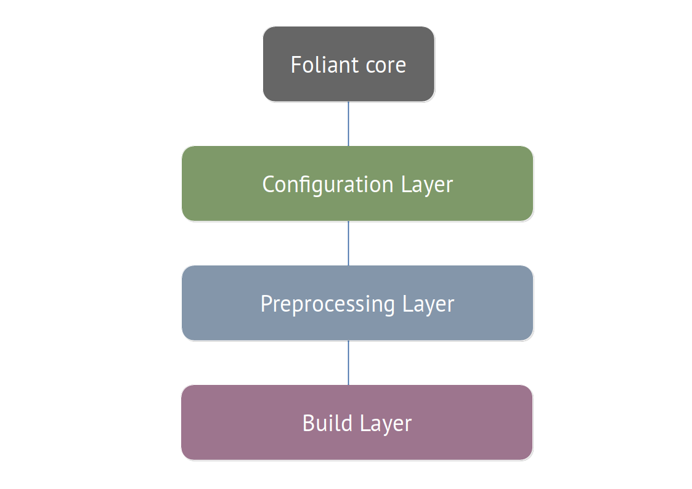

# Architecture And Basic Design Concepts

## Overview

Foliant is an open-source application written in Python.

Foliant has a modular architecture. It consists of three layers:

* **Configuration Layer** reads Foliant project configuration file and CLI parameters supplied by the user;
* **Preprocessing Layer** adjusts the Markdown sources before the build;
* **Build Layer** produces the documentation in the final format.

Each layer is supervised by [Foliant Core](https://github.com/foliant-docs/foliant/). *Foliant Core* is a relatively compact and rarely updated Python package. It is a dispatcher which manages installed extensions according to the configuration.

Let's take a closer look at each layer of Foliant's architecture.

### Configuration Layer

At the configuration Layer, Foliant processes the CLI-command and reads the command arguments, which were supplied by the user. The Main Foliant command is `make`, it is the command which builds the documentation project. But there are other commands which may do other things, for example, display the project's metadata (the `meta generate` command) or generate a new project file structure (the `init` command).

If `make` command was used, Foliant reads and processes the project configuration file. At this stage, all installed Configuration Extensions are applied to the project config.

### Preprocessing Layer

At the preprocessing layer, Foliant runs the Preprocessor Pipeline, that was defined in the config. Each preprocessor is applied to the Markdown source in the specified order. Preprocessors may:

- call external services, for example, get data from a Swagger API website or an SQL Database;
- use local files, for example, templates for text generation, or Markdown snippets for content reuse;
- call external tools, for example, PlantUML to generate diagrams from code, or ImageMagick to resize images.

Finally, the preprocessor may not use any external services or local files, but do the processing itself. For example, perform auto-replace in the text or generate a glossary for the terms in the project.

### Build Layer

At the build layer, Foliant runs the Backend, which was specified in the `make` command parameters. The Backend produces the documentation in the final format. It may be a local file like PDF or a directory with static website contents, or the Backend may upload the result to an external service like Confluence.

## Foliant Extensions

As was mentioned above, the main Foliant package is Foliant Core. But Foliant Core itself does not build documentation projects, instead it delegates this job to extensions. The Core package also defines base classes for all types of extensions.

There are 4 types of base Foliant extensions.

* **CLI extensions** extend Foliant’s command-line interface and provide additional actions that may be called from the command line. This is always the topmost component of any Foliant's action. *foliant* ***make*** is in fact a CLI extension that builds projects.
* **Config extensions** allow to customize the project configuration parsing, add custom YAML tags and new configuration options. For example, MultiProject extension adds a YAML tag `!from` which allows to include multiple nested Foliant projects into a single parent project.
* **Preprocessors** are modules which apply various transformations to the source Markdown content before passing it to a backend. The transformations include:

    * replacing parts of content according to specific rules;
    * rendering diagrams and schemes from source code;
    * embedding content from external files;
    * getting data for your documentation project from external services, e.g. remote Git repositories, Swagger, Testrail, Figma, Sympli, SQL Databases etc.;
    * seting high-level semantic relations between different parts of content to provide smart cross-target links, or restructure single-source documentation automatically and context-dependently;
    * running arbitrary external commands.

    Each Foliant project may use any number of preprocessors. Preprocessors are applied sequentially, one after another. The same preprocessor may appear more than once in the pipeline.
* **Backends** build the project's Markdown content into final formats which we call *targets*, e.g. PDF files or static sites. Backends may call third-party software to produce the final documentation or upload your content to an external service, e.g. Confluence. A single backend may generate multiple targets. Different backends may build the same target. For example, a static site (the `site` target) can be built with 3 official backends: MkDocs, Slate, and Aglio. If several of them are installed, user may specify the certain backend in the `foliant make` command or it will be asked interactively.

## Project Build Process

The project build process is operated by Foliant CLI extension called *make*, which is a part of Foliant Core package.

**The steps of the build process**

1. User calls a `make` command specifying the backend and the target he wants to build, for example:
    
        $ foliant make site --with mkdocs

    In this example, the target is `site` and the backend is `mkdocs`. `--with` argument is optional, `make` will assume the backend or ask for user input if there are several options for the target.

2. `make` launches the project build in the following stages:
    1. **Configuration parsing**. The project configuration file (`foliant.yml` by default) is processed by each installed *Config extension* and saved into the internal context.
    2. **Copying sources**. The `src` folder which holds Markdown source files of the project is copied into a temporary folder (`__folianttmp__` by default). Preprocessors will only affect the copies, leaving the sources intact.
    3. **Preprocessing**. Each *preprocessor* defined in the project configuration file is subsequently applied to the temporary folder with copies of Markdown sources. The preprocessors run in an order in which they are specified in the `preprocessors` list, but each backend may implicitly add specific preprocessors to the beginning or the end of this list.
    4. **Producing output format**. The chosen *backend* takes the Markdown files from the temporary folder and converts them into the target format.
    5. **Removing temporary files**. If `make` wasn't run with `--keep-tmp|-k` argument, the temporary folder with preprocessed Markdown sources is removed from the project dir.
