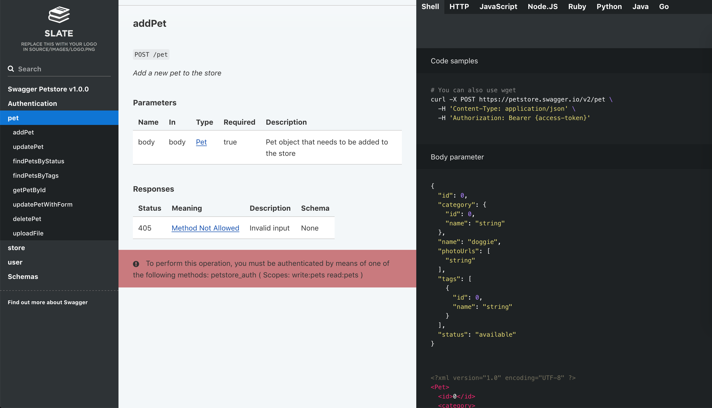
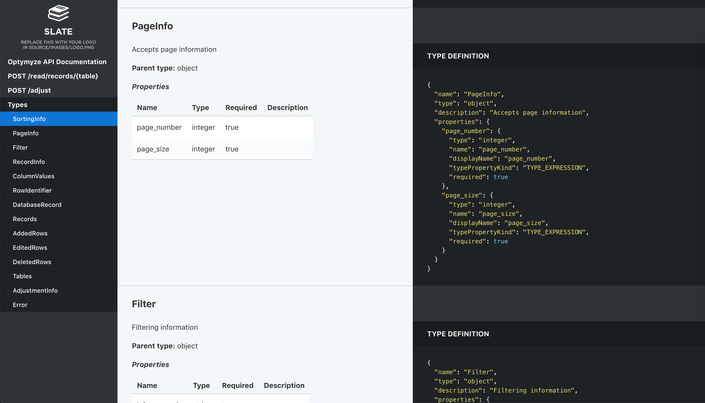
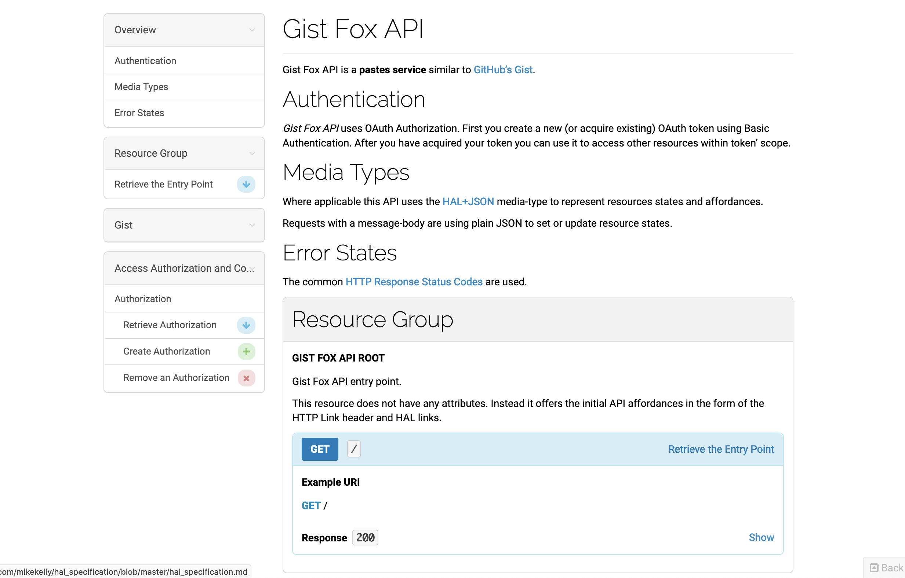
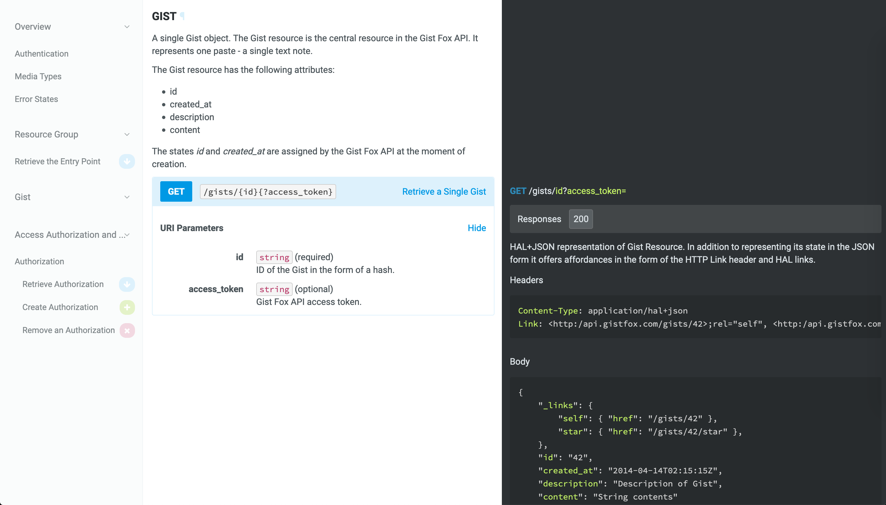

# Documenting API with Foliant

In this tutorial we will learn how to use Foliant to generate documentation from API specification formats [OpenAPI (Swagger)](https://swagger.io/specification/), [RAML](https://raml.org/) and [API Blueprint](https://apiblueprint.org/).

The general idea is that you supply a specification file path (`json` or `yaml` for OpenAPI, `raml` for RAML) to a preprocessor which will generate a Markdown document out of it. Markdown is what Foliant is good at, so after that you can do anything with it: convert to PDF, partially include in other documents, etc. In this guide we will concentrate on building a static website for your API documentation.

> Please note that in this article we cover only the basic usage of the tools. For detailed information on features and customizing output refer to each component's doc page.

## OpenAPI

### Installing prerequisites

Besides Foliant you will need to install some additional packages on your system. If you are using our full docker image `foliant/foliant:full`, you can skip this chapter.

First, install the [SwaggerDoc](https://foliant-docs.github.io/docs/preprocessors/swaggerdoc/) preprocessor which will convert spec file to Markdown.

```shell
pip3 install foliantcontrib.swaggerdoc
```

SwaggerDoc preprocessor uses [Widdershins](https://github.com/Mermade/widdershins) under the hood, so you will need to install that too.

```shell
npm install -g widdershins
```

Finally, to build the static website we will be using [Slate backend](https://foliant-docs.github.io/docs/backends/slate/):

```shell
pip3 install foliantcontrib.slate
```

Also note that Slate requires [Ruby](https://www.ruby-lang.org/en/) and [Bundler](https://bundler.io/) to work (that's a lot of dependencies, I know).

### Creating project

Let's create Foliant project. The easiest way is to use [foliant init](https://github.com/foliant-docs/foliantcontrib.init/) command. After running the command Foliant will ask you about your project name. We've chosen "OpenAPI docs", but it may be anything:

```shell
cd ~/projects
foliant init
    Enter the project name: OpenAPI docs
    Generating project... Done
    ────────────────────
    Project "OpenAPI docs" created in openapi-docs
```

In the output Foliant informs us that the project was created in a new folder `openapi-docs`. Let's copy your OpenAPI spec file into this folder:

```shell
cp ~/Downloads/my_api.yaml ~/projects/openapi-docs
```

In the end you should get the following directory structure:

```
└── openapi-docs
    ├── Dockerfile
    ├── README.md
    ├── docker-compose.yml
    ├── foliant.yml
    ├── my_api.yaml
    ├── requirements.txt
    └── src
        └── index.md
```

If you wish to use Docker with full Foliant image, which is the recommended way to build Foliant projects, then open generated `Dockerfile` and replace its contents with the following line:

```Dockerfile
FROM foliant/foliant:full
```

### Configuring project

Now let's set up `foliant.yml`. Right now it looks like this:

```yaml
title: OpenAPI docs

chapters:
  - index.md

```

First add and fill up the `preprocessors` section at the bottom:

```yaml
preprocessors:
    - swaggerdoc:
        spec_path: !path my_api.yaml # path to your API spec file, relative to project root
```

At this stage you may also specify path to custom templates dir in `environment: {user_tempaltes: path/to/custom/templates}` parameter. Templates describe the exact way of how to convert structured specification file into a Markdown document. For this tutorial we will be using default templates because they are perfect for our static site. Check [Widdershins docs](https://github.com/Mermade/widdershins#templates) for detailed info on templates.

The last thing we need to do is point Foliant where to insert the generated Markdown from the spec file. We already have a source file created for us by `init` command, called `index.md`, so let's use it to store our API docs.

Open `openapi-docs/src/index.md` with text editor and replace its contents with the following:

```html
<swaggerdoc></swaggerdoc>
```

Foliant will insert generated markdown on the place of this tag during build. You may even add some kind of introduction for the API docs before the tag, if you don't have such inside your spec file.

That's it! All is left to do is run `make` command to build your site.

```shell
foliant make site --with slate
    Parsing config... Done
    Applying preprocessor swaggerdoc... Done
    Applying preprocessor slate... Done
    Applying preprocessor _unescape... Done
    Making site...
...
    Done
    ────────────────────
    Result: OpenAPI_docs-2019-11-29.slate/
```

If you use docker, the command is:

```shell
docker-compose run --rm foliant make site --with slate
```

Now if you open the `index.html` from just created `OpenAPI_docs-2019-11-29.slate` folder, you should see something like this:



You can customize the page styles, add or remove language example tabs and tune other options. Check the [Slate backend](https://foliant-docs.github.io/docs/backends/slate/) documentation for details.

## RAML

Building API docs from RAML specification is quite similar to that of OpenAPI, the difference is that instead of `swaggerdoc` preprocessor you use `ramldoc`. We will go through all the steps anyway.

### Installing prerequisites

Besides Foliant you will need to install some additional packages on your system. If you are using our full docker image `foliant/foliant:full`, you can skip this chapter.

First, install the [RAMLdoc](https://foliant-docs.github.io/docs/preprocessors/ramldoc/) preprocessor which will convert spec file to Markdown.

```shell
pip3 install foliantcontrib.ramldoc
```

RAMLdoc preprocessor uses [raml2html](https://github.com/raml2html/raml2html) with [full-markdown-theme](https://github.com/Vanderhoof/raml2html-full-markdown-theme) under the hood, so you will need to install those too.

```shell
npm install -g raml2html raml2html-full-markdown-theme
```

Finally, to build the static website we will be using [Slate backend](https://foliant-docs.github.io/docs/backends/slate/). If you don't have it, run:

```shell
pip3 install foliantcontrib.slate
```

Also note that Slate requires [Ruby](https://www.ruby-lang.org/en/) and [Bundler](https://bundler.io/) to work.

### Creating project

Let's create Foliant project. The easiest way is to use [foliant init](https://github.com/foliant-docs/foliantcontrib.init/) command. After running the command Foliant will ask you about your project name. We've chosen "API docs", but it may be anything:

```shell
cd ~/projects
foliant init
    Enter the project name: API docs
    Generating project... Done
    ────────────────────
    Project "API docs" created in api-docs
```

In the output Foliant informs us that the project was created in a new folder `api-docs`. Now let's copy your RAML spec file to this folder:

```shell
cp ~/Downloads/my_api.raml ~/projects/api-docs
```

In the end you should get the following directory structure:

```
└── api-docs
    ├── Dockerfile
    ├── README.md
    ├── docker-compose.yml
    ├── foliant.yml
    ├── my_api.raml
    ├── requirements.txt
    └── src
        └── index.md
```

If you wish to use Docker with full Foliant image, which is the recommended way to build Foliant projects, then open generated `Dockerfile` and replace its contents with the following line:

```Dockerfile
FROM foliant/foliant:full
```

### Configuring project

Now let's set up `foliant.yml`. Right now it looks like this:

```yaml
title: API docs

chapters:
  - index.md

```

First add and fill up the `preprocessors` section at the bottom:

```yaml
preprocessors:
    - ramldoc:
        spec_path: !path my_api.yaml # path to your API spec file, relative to project root
```

At this stage you may also specify path to custom templates dir in the `template_dir` parameter. Templates describe the exact way of how to convert structured specification file into a Markdown document. raml2html uses [Nunjucks](https://mozilla.github.io/nunjucks/) templates, which are stored in the theme. So the easiest way to create your own templates is to copy [default](https://github.com/Vanderhoof/raml2html-full-markdown-theme/tree/master/templates) ones and adjust them to your needs. But we will use the default template which works great with Slate.

The last thing we need to do is point Foliant where to insert the generated Markdown from the spec file. We already have a source file created for us by `init` command, called `index.md`, so let's use it to store our API docs.

Open `api-docs/src/index.md` with text editor and replace its contents with the following:

```html
<ramldoc></ramldoc>
```

Foliant will insert generated markdown on the place of this tag during build. You may even add some kind of introduction for the API docs before the tag, if you don't have such in your spec file.

That's it! All is left to do is run `make` command to build your site.

```shell
foliant make site --with slate
    Parsing config... Done
    Applying preprocessor ramldoc... Done
    Applying preprocessor slate... Done
    Applying preprocessor _unescape... Done
    Making site...
...
    Project built successfully.

    Done
    ────────────────────
    Result: API_docs-2019-11-29.slate/
```

If you use docker, the command is:

```shell
docker-compose run --rm foliant make site --with slate
```

Now if you open the `index.html` from just created `API_docs-2019-11-29.slate` folder, you should see something like this:



You can customize the page styles, add or remove language example tabs and tune other options. Check the [Slate backend](https://foliant-docs.github.io/docs/backends/slate/) documentation for details.

## Blueprint

API Blueprint is a Markdown-based API specification format. That's why the build process differs from that of OpenAPI or RAML: we skip the converting step and just add the specification file as a source.

### Installing prerequisites

To build a static site we will use [Aglio](https://foliant-docs.github.io/docs/backends/aglio/) backend which is designed specifically for rendering API Blueprint. So first install the backend and [Aglio renderer](https://github.com/danielgtaylor/aglio) itself:

```shell
pip3 install foliantcontrib.aglio
npm install -g aglio
```

### Creating project

Let's create a Foliant project. The easiest way is to use [foliant init](https://github.com/foliant-docs/foliantcontrib.init/) command. After running the command Foliant will ask you about your project name. We've chosen "API docs", but it may be anything:

```shell
cd ~/projects
foliant init
    Enter the project name: API docs
    Generating project... Done
    ────────────────────
    Project "API docs" created in api-docs
```

In the output Foliant informs us that the project was created in a new folder `api-docs`. Now copy your Blueprint spec file into the `src` subfolder (it's better to change the extension to `.md` too), replacing "index.md":

```shell
cp ~/Downloads/spec.abip ~/projects/api-docs/src/index.md
```

In the end you should get the following directory structure:

```
└── openapi-docs
    ├── Dockerfile
    ├── README.md
    ├── docker-compose.yml
    ├── foliant.yml
    ├── requirements.txt
    └── src
        └── index.md
```

If you wish to use Docker with full Foliant image, which is the recommended way to build Foliant projects, then open generated `Dockerfile` and replace its contents with the following line:

```Dockerfile
FROM foliant/foliant:full
```

### Configuring project

Now check your `foliant.yml`. Right now it looks like this:

```yaml
title: API docs

chapters:
  - index.md  # this should be your API Blueprint specification

```

It may be hard to believe, but no other configuration is required! Let's build our project:

```shell
foliant make site --with aglio
    Parsing config... Done
    Applying preprocessor flatten... Done
    Applying preprocessor _unescape... Done
    Making site... Done
    ────────────────────
    Result: OpenAPI_docs-2019-11-29.aglio
```

If you use docker, the command is:

```shell
docker-compose run --rm foliant make site --with aglio
```

Now if you open the `index.html` from just created `API_docs-2019-11-29.aglio` folder, you should see something like this:



It's not near as attractive as the Slate site we had in previous examples. But don't worry, Aglio supports styling with CSS and layout control with [Jade](http://jade-lang.com/) templates. It also has several built-in themes, which look much better than the default one.

Open your `foliant.yml` again and add following lines at the end:

```yaml
backend_config:
    aglio:
        params:
            theme-variables: streak
            theme-template: triple
```

Now run the same build command:

```shell
foliant make site --with aglio
```

And look at the result:



Much better!
